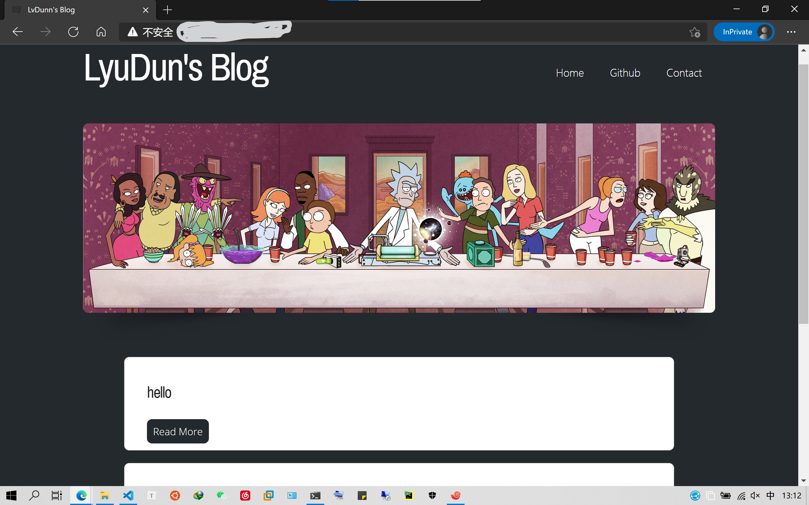
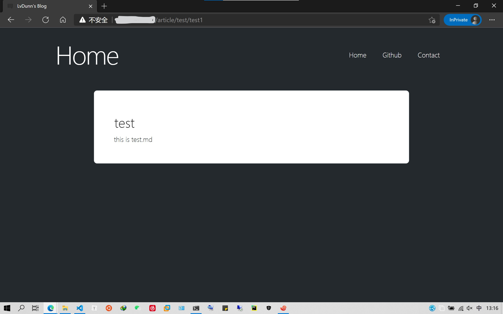

# flask blog
由Flask实现的个人博客，效果展示：
由Flask + Gunicorn（WSGI服务器） 部署





## 实现功能:

1. 代码高亮
2. markdown 解析


## 待增加功能

1. 博客后台
2. 邮件订阅
3. 更多......

## 使用(部署)方式

```bash
git clone https://github.com/LyuDun/Flask_blog.git

cd Flask_blog

pip install -r requirements.txt

cd flask

gunicorn -w 5 -b 0.0.0.0:80 Webapp:app --reload -t 500 -D
```

## 目录结构
```
|-- Flask_blog
|   |-- LICENSE
|   |-- README.md
|   |-- flask
|   |   |-- Webapp
|   |   |   |-- __init__.py
|   |   |   |-- app.py
|   |   |   |-- markdwon_article(markdown文章存放目录)
|   |   |   |   `-- ......
|   |   |   |-- static
|   |   |   |   `-- css
|   |   |   |       |-- ......
|   |   |   |       |-- images
|   |   |   |           `-- ......
|   |   |   |-- templates
|   |   |   |   `-- ......
|   |   |   `-- views.py
|   |   `-- run.py
|   `-- requirement.txt
```

## markdown文章维护方式（暂时）
在目录Flask_blog/flask/Webapp/markdwon_article 下，你可以新建文件夹来对文章分类维护，或者直接新建“某某.md” markdown文章。

文件名命名规则为：文件名.md 

举例：我在Flask_blog/flask/app/markdwon_article/Python/ 目录下,新建了一篇md文章 “一些python基础知识整理.md”。

外网访问地址就是 http://ip地址/article/Python/一些python基础知识整理 
